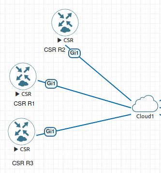
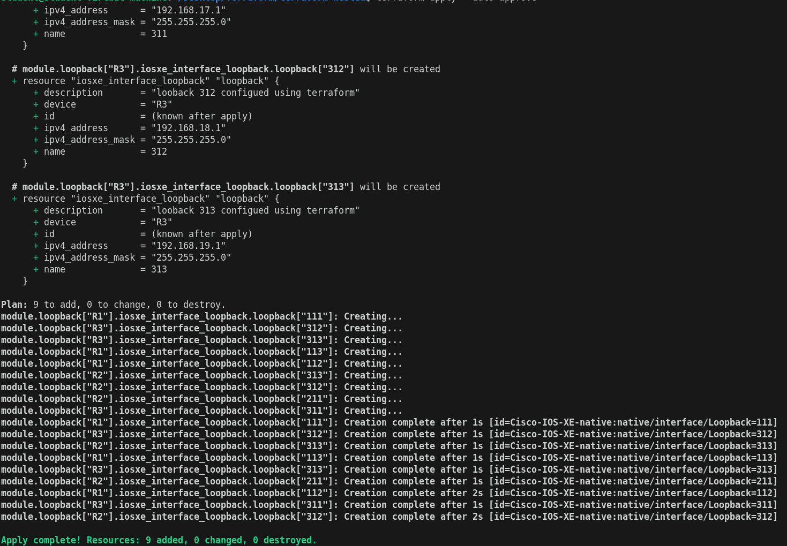
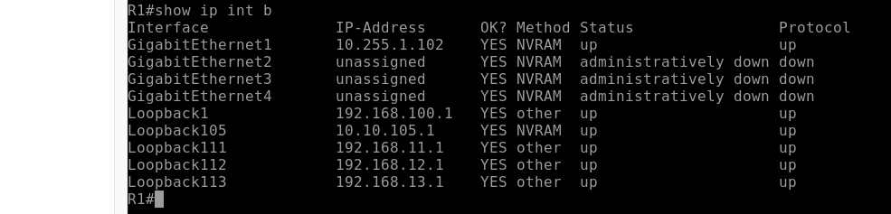
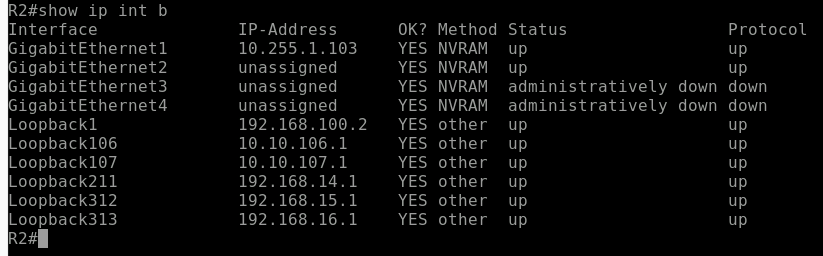
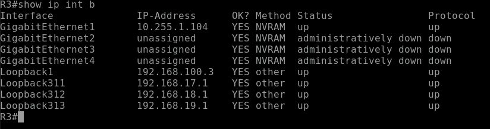

# Scalable Network IaC: Multi-Device Loopback Provisioning with Terraform (IOS XE)

## Overview
This project demonstrates a **scalable Infrastructure as Code (IaC) approach** for automating loopback interface provisioning across multiple Cisco IOS XE routers using Terraform and RESTCONF.

The solution uses a **modular and data-driven design** to dynamically configure:
- Multiple routers
- Multiple loopbacks per router
- Custom loopback IDs and IP addressing per device

---

## Key Features
-  Multi-device support (R1, R2, R3)
-  Multiple loopbacks per router
-  Per-device loopback customization
-  Modular Terraform design (reusable module)
-  RESTCONF-based configuration
-  Declarative and scalable architecture

---

## Topology



---

## Architecture Approach
This project follows a **declarative and modular design pattern**:

- A `locals` block defines loopback mappings per router
- A reusable Terraform module applies configurations
- `for_each` is used to:
  - Iterate over routers
  - Iterate over loopbacks per router

### Example Mapping

locals {
  router_loopbacks = {
    "R1" = {"111" = "11","112" ="12","113" ="13"}
    "R2" = {"211" = "14","312"="15","313"= "16"}
    "R3" = {"311" = "17","312"="18","313"= "19"}
  }
}

Each router gets its own unique set of loopbacks and IP ranges.

---

## Terraform Execution


---

## Device Configuration Results

### R1 Loopbacks


### R2 Loopbacks


### R3 Loopbacks


---

## Prerequisites
- Terraform installed
- Cisco IOS XE devices with RESTCONF enabled
- Network connectivity to devices
- Valid credentials

---

## Usage

### 1. Initialize Terraform
```bash
terraform init
```

### 2. Create variables file
```hcl
# terraform.tfvars
password = "your_password"
```

### 3. Apply configuration
```bash
terraform apply
```

---

## Notes

- All credentials and IPs shown are from a lab environment
- No production systems are exposed
- Sensitive files are excluded using .gitignore

---

## Business Value
This project reflects real-world network automation practices by:

- Reducing manual configuration effort and human error
- Ensuring consistency across devices
- Enabling scalable deployments
- Supporting DevOps and Infrastructure as Code methodologies

---

## Future Enhancements
- Extend to VLANs, routing protocols, ACLs
- Integrate with CI/CD pipelines
- Add validation and compliance checks
- Combine with Ansible for hybrid automation workflows

---

## Author
Amina Ahmed
